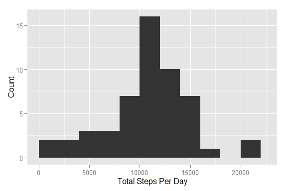
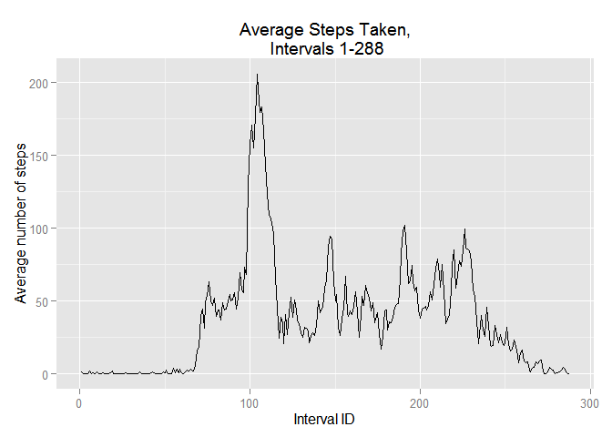

# Reproducible Research: Peer Assessment 1


## Loading and preprocessing the data

First, read and unzip the file in the following way:


```r
unzip('./activity.zip', overwrite = TRUE)
activityData <- read.csv2('./activity.csv', sep=',')
```

## What is mean total number of steps taken per day?

The analysis assumes that the analyst has the following packages installed on the machine: 

- dplyr 
- ggplot2


```r
library(dplyr)
```

```
## 
## Attaching package: 'dplyr'
## 
## The following object is masked from 'package:stats':
## 
##     filter
## 
## The following objects are masked from 'package:base':
## 
##     intersect, setdiff, setequal, union
```

```r
library(ggplot2)
stepsPerDay <- summarise(group_by(activityData, date), steps_per_day=sum(steps, rm.na=TRUE))
meanStepsPerDay <- mean(stepsPerDay$steps_per_day, na.rm=TRUE)
medianStepsPerDay <- median(stepsPerDay$steps_per_day, na.rm=TRUE)
```
The average number of steps per day is: 1.0767189\times 10^{4}. The median number of steps per day is: 10766.

To visualize the distribution of total steps per day, the following command is executed:


```r
 qplot(stepsPerDay$steps_per_day, data=stepsPerDay, geom="histogram", xlim=c(0,22500), xlab='Total Steps Per Day', ylab='Count', binwidth=2000)
```

 


## What is the average daily activity pattern?

I need to first create a new dataframe with interval step averages. NA values will be removed for simplicity in this step to get a first idea. We will look at numbers of NA values further below. Originally, I wanted to use dplyr but I can't seem to figure out how to get that to work. So I am falling back to more simple data manipulations.

### Processing Code

```r
intervalId <- rep(1:288,61)
dateId <- rep(1:61, each = 288)
activityData2 <-cbind(intervalId, dateId, steps=activityData[,1])
intervalmeans <- c()
for (i in 1:288){
    value2 <- mean(activityData2[activityData2[,1] == i,3], na.rm=TRUE)
    intervalmeans <- c(intervalmeans,value2)
}
activityData3<-cbind(1:288, intervalMeans = intervalmeans)
```

### Analytic Code


```r
qplot(activityData3[,1], activityData3[,2], geom=c('line'),
    main = "Average Steps Taken,\n Intervals 1-288",
    xlab = "Interval ID", 
    ylab = "Average number of steps")
```

 

To find out what interval contains the largest average numer of steps, find the maximum value. Then find the interval this value belongs to.


```r
maxAverageSteps <- max(activityData3[,2])
intervalWithMax <- activityData3[activityData3[,2] == maxAverageSteps]
intervalWithMax
```

```
## [1] 104.0000 206.1698
```


The interval with the largest average steps is:

```r
intervalWithMax[1]
```

```
## [1] 104
```
The average number of steps taken during that time is:

```r
intervalWithMax[2]
```

```
## [1] 206.1698
```

## Imputing missing values

Let's find out how many missing values there are: 

```r
missingValues <- activityData[is.na(activityData$steps),]
numberOfMissingValues <- length(missingValues[,1])
numberOfTotalEntries <- length(activityData[,1])
numberOfMissingValues
```

```
## [1] 2304
```

There are 2304 missing values out of `r numberOfTotalEntries That's a lot of values to simply ignore. I will fill in the missing values with the median value for that interval.


## Are there differences in activity patterns between weekdays and weekends?
